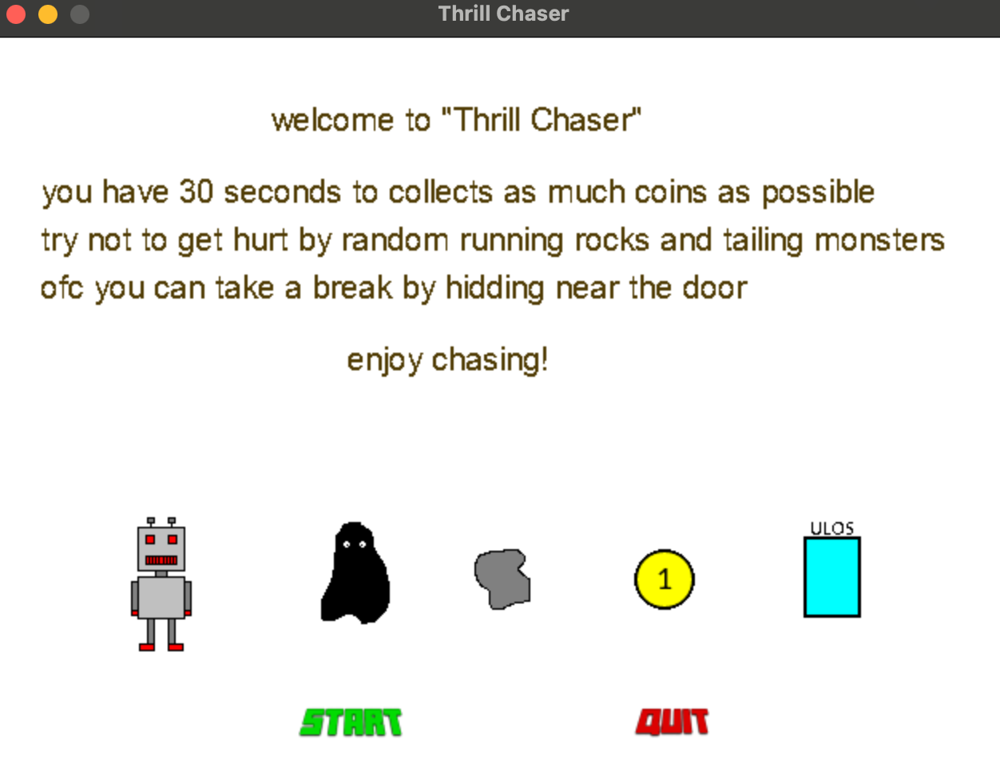
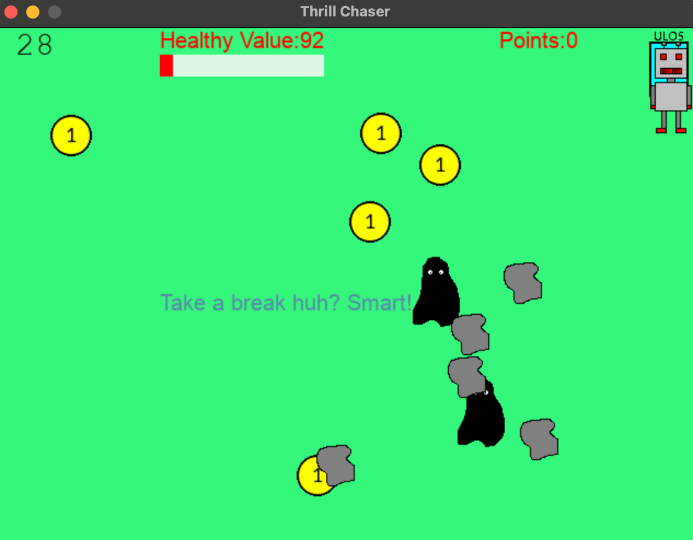
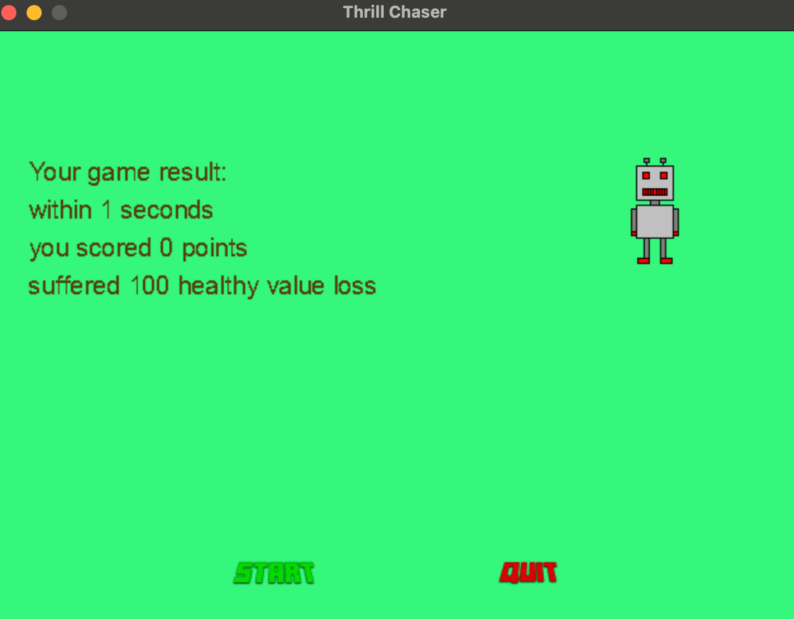

Game rules:
-> Player has 30 second to collect as much coins as possible\
-> Player is defaulted to have 100 units healthy value\
-> There are maximum 5 randomly moving rocks inflict 0.5 unit healthy value to player,
    the more points player get, the faster these rocks moves.
-> There are two tailing monster which can inflict 1 unit healthy value to player.
-> Player can take a break think about next move by hidding near the door.

Some screenshots about this game:

